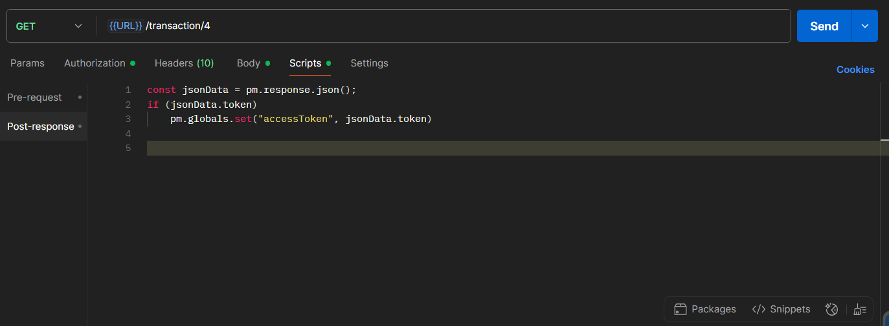

# Library Management System

<h2>Features</h2>
<ul>
    <li>Staff and Members can signup and login</li>
    <li>Staff can delete members.</li>
    <li>Staff can update, delete transactions</li>
    <li>Staff can add or delete genres.</li>
    <li>Members can purchase books.</li>    
</ul>

 

<h2>Technologies</h2>
<h3>Server</h3>
<ul>
    <li>Nodejs</li>
    <li>Express</li>
    <li>http-status-codes (for sending status codes)</li>
</ul>

 

<h3>Database</h3>

<ul>
    <li>Postgresql</li>
</ul>

 

<h2>Configuration and Setup</h2>

In order to run this project locally, simply fork and clone the repository or download as zip and unzip on your machine.

<ul>
    <li>Open the project in your prefered code editor.</li>
    <li>Go to terminal -> New terminal (If you are using VS code)</li>
</ul>

 

<h2>In the terminal</h2>

Copy these commands and paste in your terminal

<ul>
    <li>npm install</li>
    <li>npm start</li>
</ul>

 

<h2>Postman scripts</h2>
<ul>
    <li>Open Postman</li>
    <li>In Scripts tab, and paste these commands :-</li>
</ul>

 

 
 
<h2>Author</h2>
<ul>
    <li>Github : <a href = "https://github.com/shrivastav05aman">@shrivastav05aman</a></li>
</ul>
